# Insufficient Input Validation
## Overview

1. Name of Vulnerability: Insufficient Input Validation

2. Learning Objectives: By the end of this lesson, learners should be able to:
Understand why all user inputs should be validated.
Know the proper way to implement validation checks.
Understand what constitutes poor or inadequate validation.

3. Lesson Activity: This lesson will guide learners through entering email information that doesn't meet required validation standards and changing the price of an item before buying. We'll explore how these actions can be detrimental to a business and how to prevent them.

4. Application Context: This web application features a registration page (with registration and login forms), a product page, and a cart page, all built with Jinja2. The backend utilizes FastAPI, SQLAlchemy, Stripe, and a MySQL database. The non-validated data from the registration form will demonstrate how invalid data (like non-emails or excessively long passwords) can be stored in your database. The 'Buy' and 'Cart' functionalities will illustrate why, even if a price is displayed on the page, it's crucial to validate the data received by the backend against the database to ensure the correct price is charged.

The vulnerability we will be discussing in this section is Insufficient Data Validation. It's crucial to understand why this vulnerability can cause significant issues and be a major detriment to any business or website. This example application has a registration form that initially only has front-end validations (specifically, a 'required' field attribute and an 'email' input type). Similarly, the password field only has a 'required' field front-end validation. The 'Buy' page allows you to click a 'Buy' button, which takes you to a cart page where you can purchase an item.

# The Risk of Insufficient Input Validation

This vulnerability deserves careful attention. If we fail to validate user-provided information before processing it on the backend or storing it in our database, we open the door to a multitude of issues. Without proper validation, potential security risks include SQL injection, cross-site scripting (XSS), and command injection. Furthermore, it can cause applications to crash, become unstable, and lead to compliance violations, among other problems.

# Registration Form Vulnerabilities

You'll see that you can enter almost any information into the email and password fields. This data, if unchecked, gets saved directly into our database, potentially storing invalid email formats or passwords that are too long, too short, or don't meet complexity requirements. Later, when we examine the cart, you'll see how the price of an item can be manipulated. If the price data comes solely from the front end without being validated against the database, a seller could inadvertently sell an item at a drastically incorrect price (in our example, even paying the buyer $100).

We will implement logic to ensure that all user input is properly validated before processing, preventing issues within our application. A few key points to remember before we start: Anything the user can access and provide input for needs validation. This includes not just emails, passwords, and item prices, but also dates, credit card numbers, phone numbers, and more, although we'll focus on the former in this lesson.

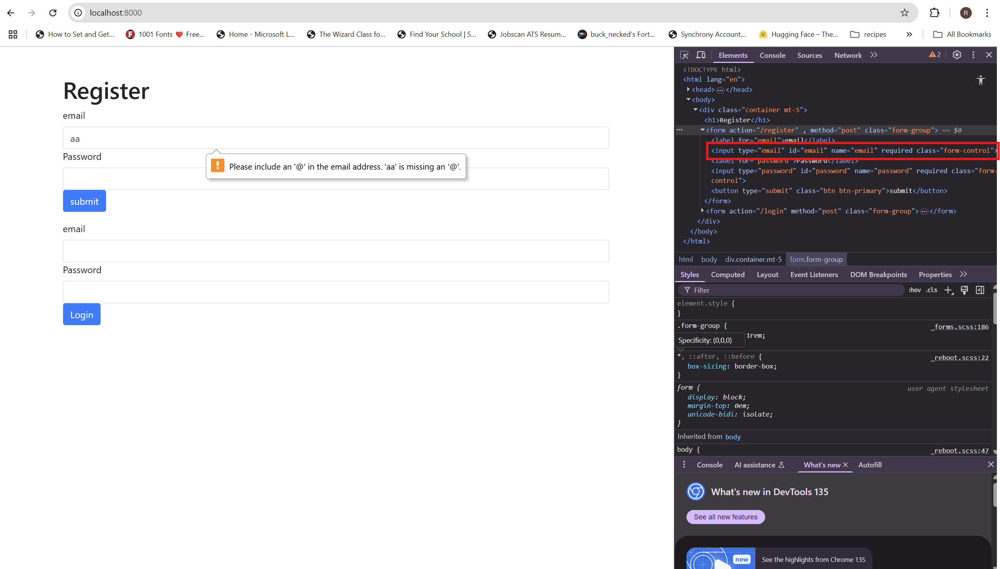
In this photo, we use the browser's inspect tool to see that the input type is set to 'email' and the field is marked as 'required'. The image also shows that attempting to enter an invalid email triggers a browser warning, prompting for an '@' sign to fulfill the basic HTML5 validation. The same 'required' validation applies to the password field 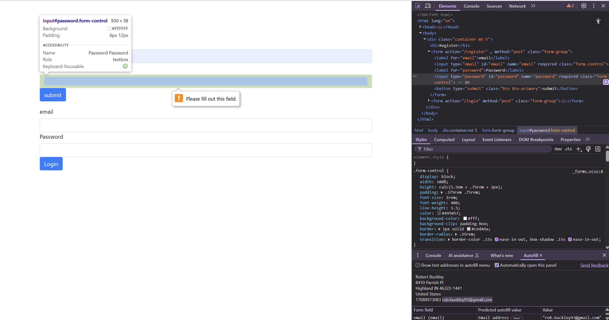. Now, what happens if we use the inspect tool to remove the 'required' attribute and change the input 'type' for the email field?


This next picture demonstrates that without these front-end validations (which anyone can bypass using browser tools), our database can easily accumulate bad data.


Beyond storing invalid data, allowing users to submit extremely long emails or passwords can lead to application crashes or slowdowns, potentially causing a Denial of Service (DoS). While emails and passwords can often safely be up to 255 characters, input exceeding reasonable limits should be rejected by our backend application logic to prevent these problems. So, how do we fix this properly?

# Fixing Input Validations

Although front-end validations provide immediate feedback to the user, we must not rely on them alone. We need backend validation to perform rigorous checks before saving data to our database. As data flows from our routes to our services (where database interactions happen), we can insert a validation step. One powerful built-in Python tool for this is regular expressions (regex). We import the re module and then define patterns (expressions) that the input must match. Many online resources and tools can help create and test regex patterns for things like emails and passwords.
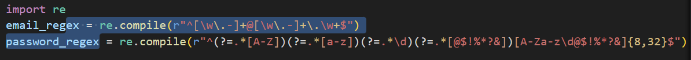

Here's the validator code we'll implement in our user_service:

```Python

import re # Ensure re is imported
from sqlalchemy.ext.asyncio import AsyncSession
from sqlalchemy.future import select

# Example regex patterns 
email_regex = re.compile(r'([A-Za-z0-9]+[.-_])*[A-Za-z0-9]+@[A-Za-z0-9-]+(\.[A-Z|a-z]{2,})+')
password_regex = re.compile(r'^(?=.*[a-z])(?=.*[A-Z])(?=.*\d)(?=.*[@$!%*?&])[A-Za-z\d@$!%*?&]{8,}$') # Example: Min 8 chars, 1 upper, 1 lower, 1 digit, 1 special

class UserRegisterValidation:
    def __init__(self, session: AsyncSession):
        self.session = session

    async def validate_user(self, email: str, password: str, request) -> bool:
        # Returns True if validation FAILS, False otherwise
        # Stores specific errors in request.session["flash_messages"]
        errors_found = False
        flash_messages = request.session.get("flash_messages", [])

        try:
            # Check if email already exists
            query = select(user_models.User).where(user_models.User.email == email)
            result = await self.session.execute(query)
            user = result.scalars().first()

            if user:
                flash_messages.append({"email": "Please use a different email", "category": "error"})
                errors_found = True

            # Validate email format
            if not email_regex.match(email):
                flash_messages.append({"email": "Invalid email format", "category": "error"})
                errors_found = True

            # Validate email length
            if len(email) < 5 or len(email) > 90:
                 flash_messages.append({"email": "Email must be between 5 and 90 characters", "category": "error"})
                 errors_found = True

            # Validate password complexity
            if not password_regex.match(password):
                flash_messages.append({"password": "Password must include at least one uppercase letter, one lowercase letter, one digit, and one special character", "category": "error"})
                errors_found = True

            # Validate password length
            if len(password) < 8 or len(password) > 32:
                flash_messages.append({"password": "Password must be between 8 and 32 characters", "category": "error"})
                errors_found = True

            request.session["flash_messages"] = flash_messages
            return errors_found # Return True if any error was found

        except Exception as e:
            print(f"Error validating user: {e}")
            # Handle exceptions appropriately, maybe add a generic error flash message
            flash_messages.append({"form": "An unexpected error occurred during validation.", "category": "error"})
            request.session["flash_messages"] = flash_messages
            return True # Indicate validation failed due to exception
```
In this validator, we take the email and password submitted by the user via the registration form. It performs several checks:

Ensures the email isn't already in the database (preventing duplicates).
Verifies the email matches our defined regular expression pattern.
Checks that the email length is between 5 and 90 characters.
Verifies the password matches its regular expression pattern (enforcing complexity).
Checks that the password length is between 8 and 32 characters.
If any of these validations fail, we generate a 'flash message' containing specific error details to send back to the user interface. Now that we have our validator, where do we integrate it?

# Integrating the Validator

We integrate the validator within our service layer, specifically where we handle adding the user's information to the database. Here's the code before implementing the validation:

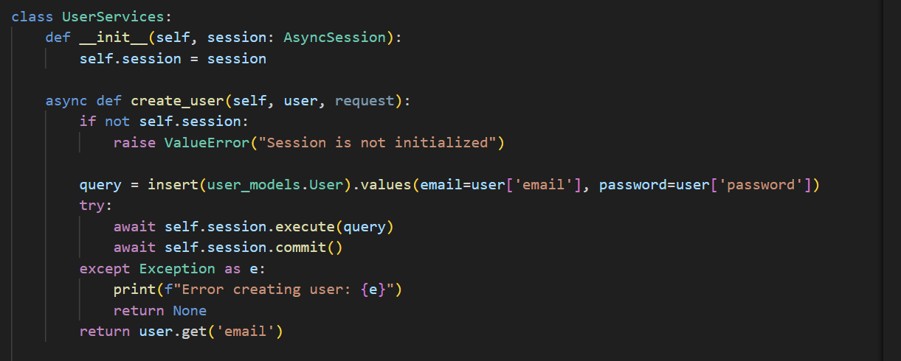

Notice on line 26, a query is created, and on line 28, this query is used to add the user information directly to the database without ever validating it first.

Now, let's modify this. Before creating the database query (around line 26), we'll use our new validator to check the incoming data:

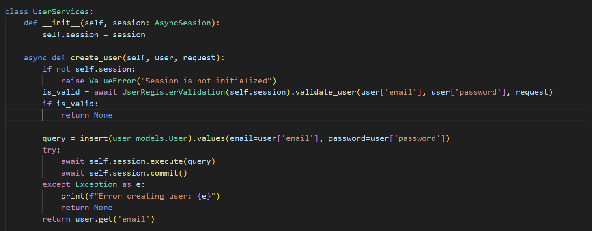


In this updated code, before proceeding with the database insertion, we call our UserRegisterValidation (instantiated perhaps earlier or passed in). This call checks the user's submitted email and password. The validator returns True if there's an error (and stores messages in the session) or False if the data is valid. If the validation check indicates an error (is_valid is True in the example logic), the service function returns early (e.g., returns None), preventing the invalid data from reaching the database.

With the error information stored in the session (as flash messages), we can display it on the HTML page. First, we need to pass these messages from our user_route when rendering the template.

Picture before adding flash message handling in the route:

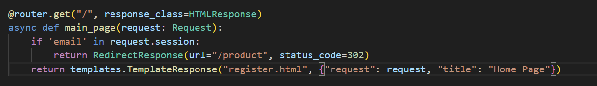

Picture after adding flash message handling in the route:

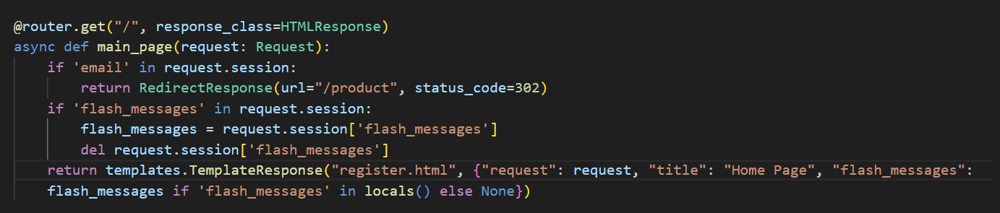

In the updated route code (rows 26-28), we check for flash messages in the session and pass them to the template (row 29) via the flash_messages variable.

Here’s our basic register/login form before adding the logic to display session messages:

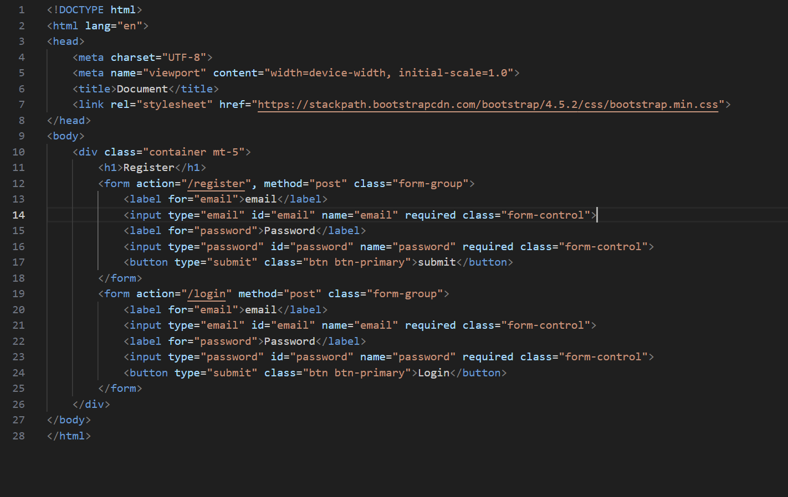

And here’s how it looks after adding the necessary template code to display the messages:

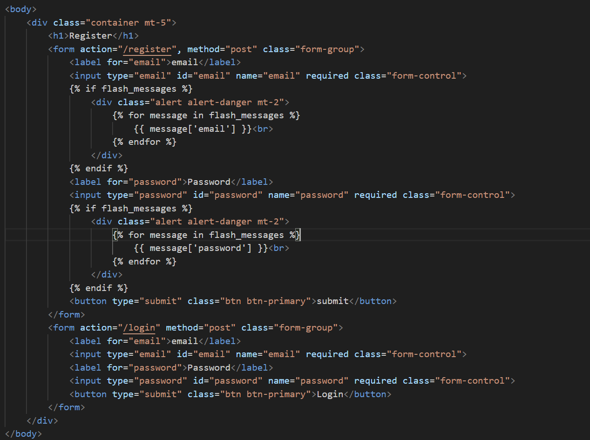

Now, let's see this in action. What happens if we try to register with an email address that's already in use?

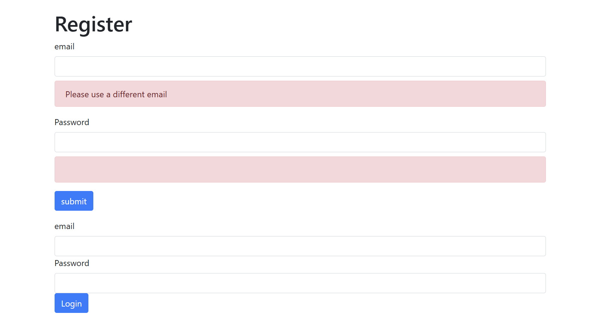

This is the expected response – a specific error message is displayed.

Next, what if we enter an email and password that fail other validation rules (e.g., invalid format or length)?

In this scenario, let's try using "c@c.c" as the email and "123456" as the password.


As shown in the image, our flash messages clearly indicate the validation failures, and crucially, this invalid data is not added to the database.

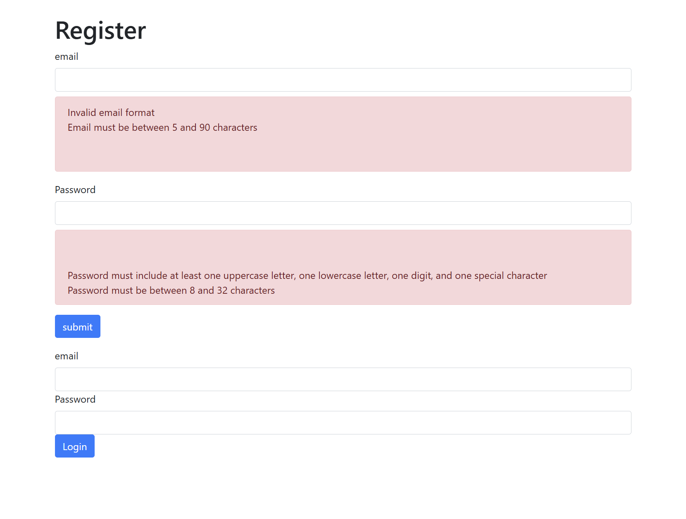

We can see the database still only contains the original valid entry ('a'/'a').

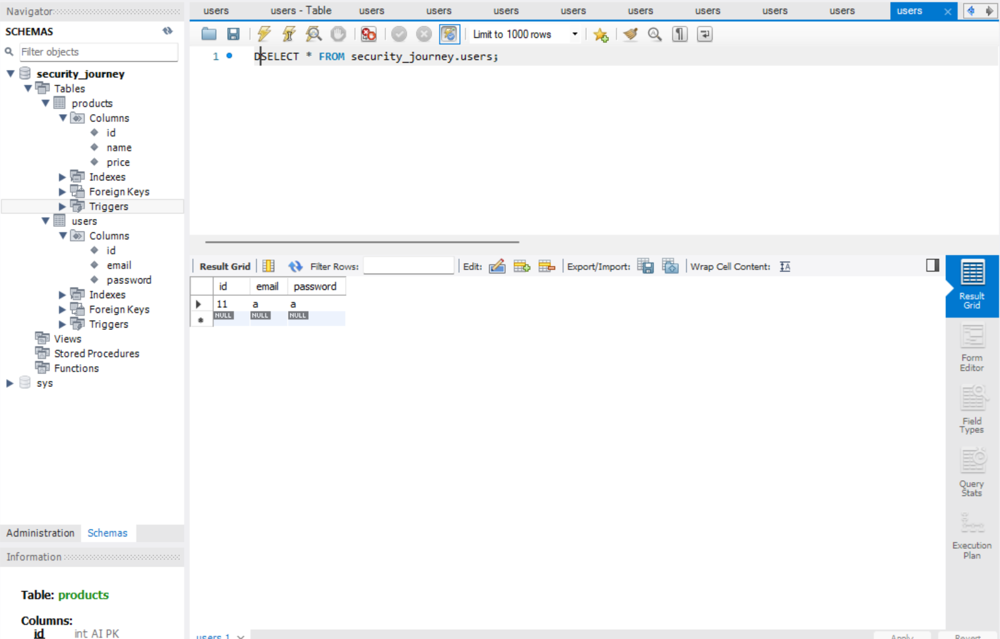

Finally, let's submit valid registration data. (Important side note: Always hash passwords before storing them in a database for security; never store them in plain text.)

Here is our database after successfully entering an email and password that pass our validation checks.


# Buying Validations

Now, let's look at validation in the context of purchasing an item.

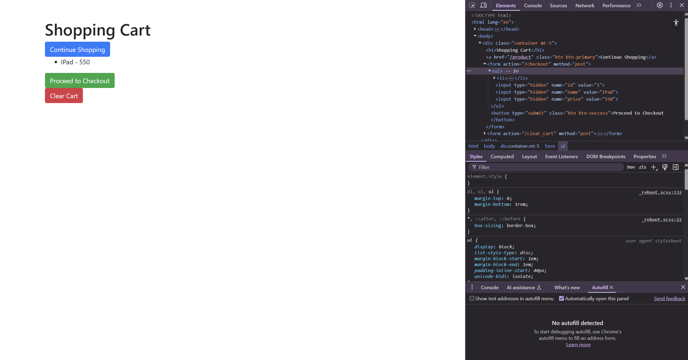

In this screenshot, we've used the inspect tool on the shopping cart page. Notice the three hidden input fields used to send the product id, price, and name back to the server when the user proceeds to checkout. You should never rely on price (or name) data sent directly from the client-side form, as it can be easily manipulated.

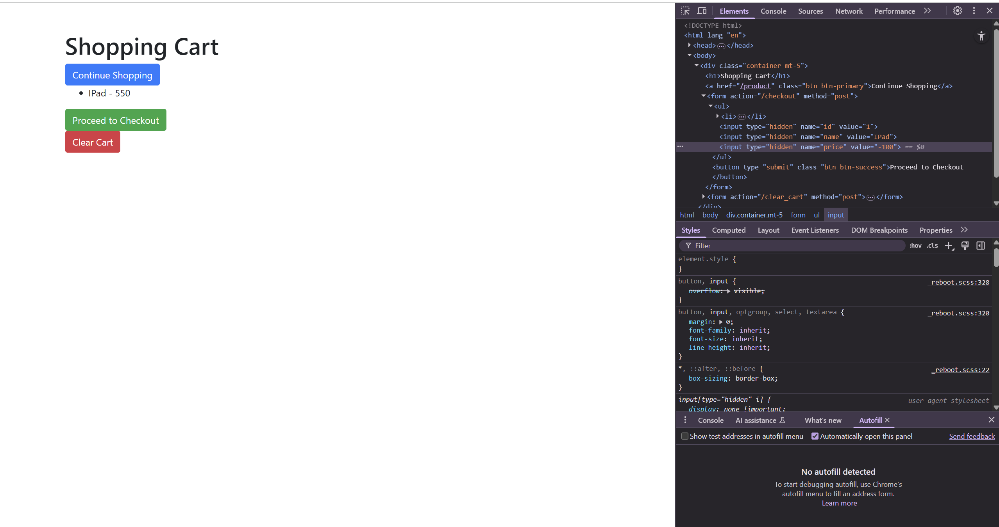

Here, we've used the inspect tool to change the hidden price input to -100. If the backend blindly trusts this submitted price,

the result is disastrous: we've effectively 'sold' an iPad for -$100, meaning we lost the item and paid the customer $100! This happened because the application trusted the price sent from the HTML form.

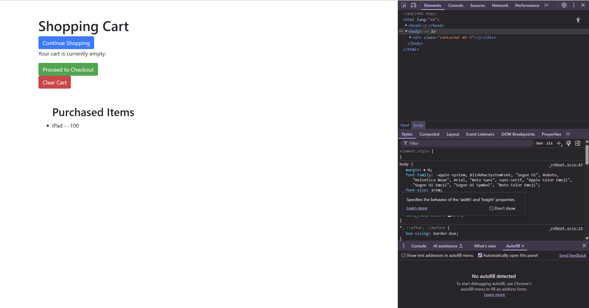

So, how do we handle this correctly?

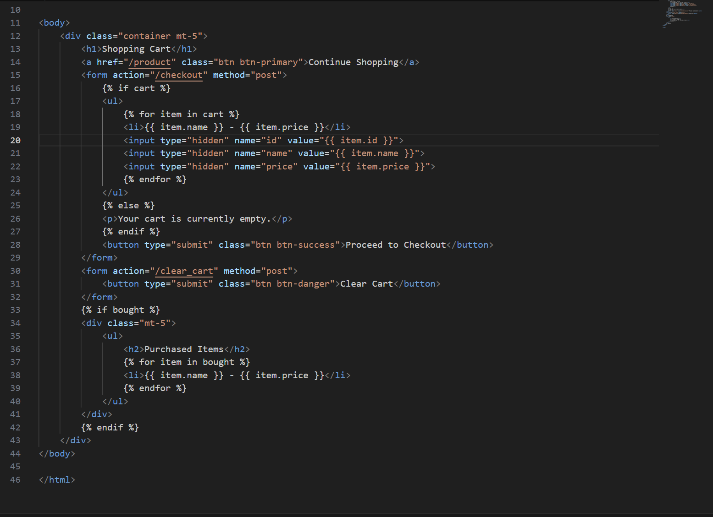

As shown, the original HTML form included hidden inputs for id, name, and price. The correct approach is to only send the unique product identifier (product_id) from the client. We remove the hidden inputs for name and price. Why? Because we can (and should) use the product_id received on the backend to securely retrieve the correct, authoritative price and name directly from our database.


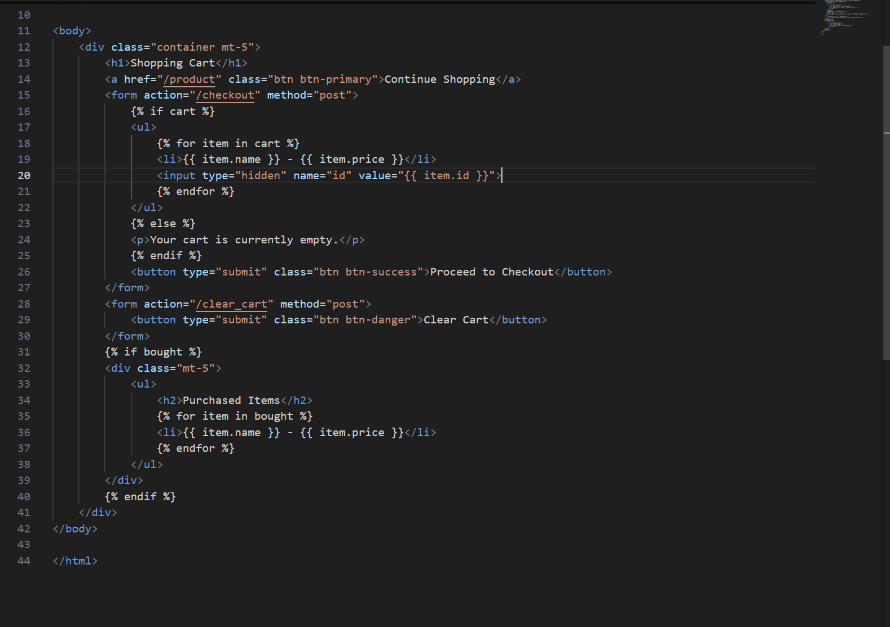

Now that we've removed the name and price hidden inputs from the HTML, we need to adjust our backend (product_route and product_service) accordingly.

Here's the vulnerable /checkout route code before the fix:

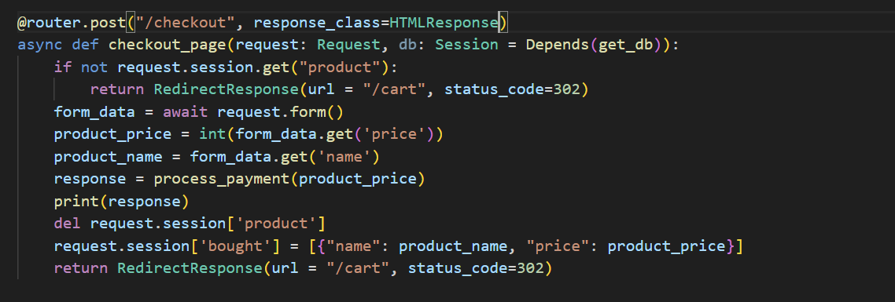

Observe how it extracts the price directly from the submitted form data, converts it to an integer, and passes it to the payment processing logic. This is insecure.

Instead, we need a method in our product_service to fetch the product details (including the correct price) using only the product_id. Here's the code for that service method:

```Python
async def get_product_by_id(self, product_id: int) -> product_schema.ProductCreate:
    try:
        if not product_id:
             return None
        query = select(product_model.Products).where(product_model.Products.id == product_id)
        result = await self.session.execute(query)
        product = result.scalars().first()
        return product_schema.ProductCreate.from_orm(product) if product else None
    except Exception as e:
        print(f"Error fetching product by ID: {e}")
        return None
```
This service function takes the product_id (received by the route from the form), uses it to query the database for the corresponding product, and returns the product's full details (including the price and name) retrieved from the database.

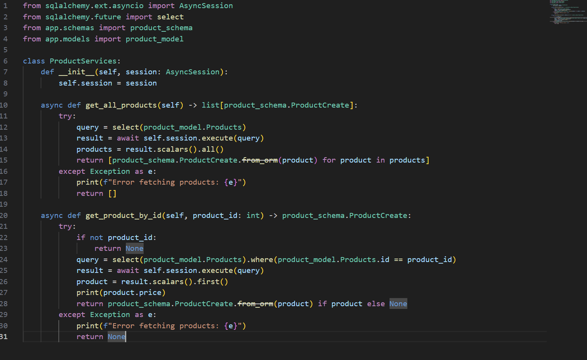

Now, let's revisit our product_route and update the /checkout endpoint to use this secure approach:

[alt text](imgs/post_checkout_route.png)

In the corrected route, we now extract only the product_id from the submitted form data. We pass this id to our product_service's get_product_by_id method to retrieve the product information directly from the database. Crucially, we then use the price obtained from the database record (not the form) to process the payment. With this change, the user can no longer tamper with the price via the browser; the correct price will always be sourced directly from the database.

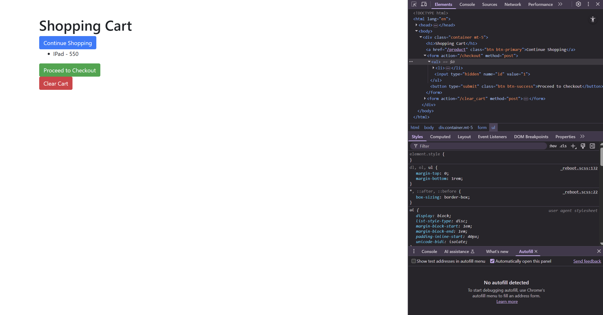

Here, we confirm that the updated shopping cart HTML now only contains the hidden input for product_id.

And finally, the checkout process now correctly charges the authoritative price retrieved from the database.

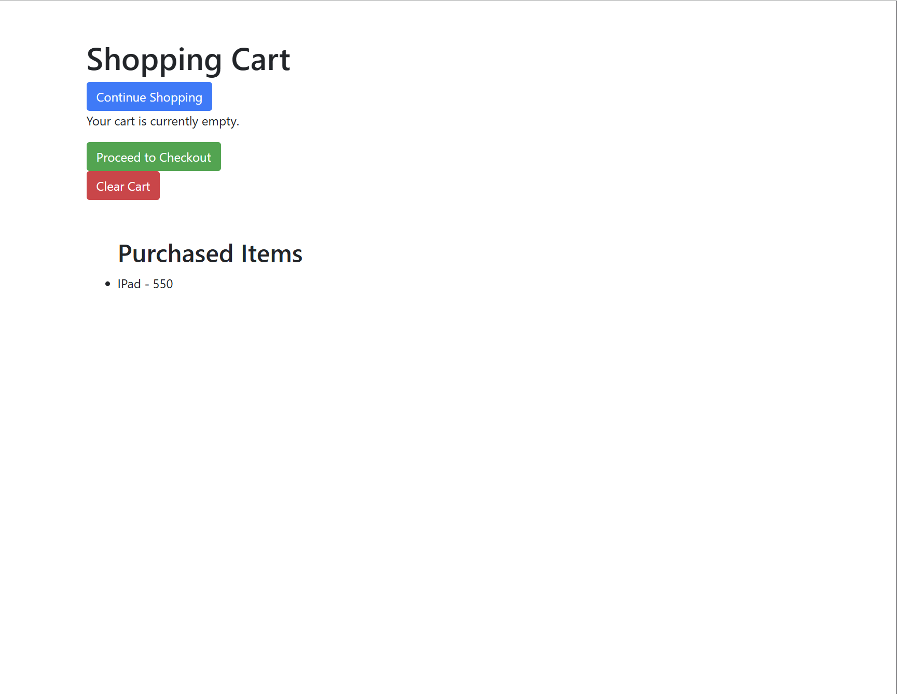

## Wrap Up

Always validate all user input on the backend to ensure it meets expected formats, types, lengths, and constraints (e.g., valid dates, correctly formatted credit card numbers, reasonable comment lengths). This practice is essential for preventing malicious or invalid data from entering your application, protecting your database integrity, and ensuring stable, secure operations.